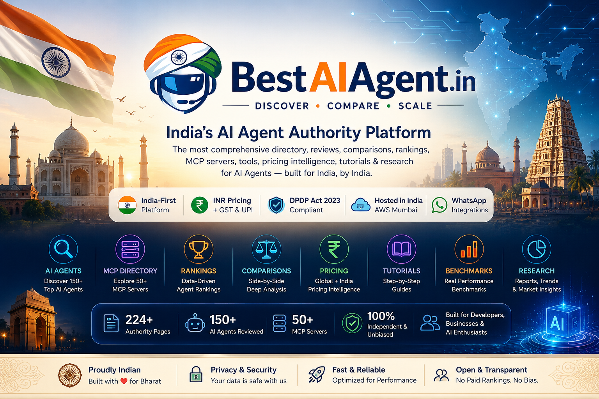

# BestAIAgent.in

Best AI Agent Directory, MCP Directory, AI Agent Rankings, Reviews, Comparisons, Pricing, Benchmarks, and Tutorials.

## GitHub Topics

`ai-agents` `ai-agent` `agentic-ai` `mcp` `model-context-protocol` `ai-tools` `ai-directory` `ai-agent-framework` `langgraph` `crewai` `autogen` `cursor-ai` `github-copilot` `vapi` `flowise` `dify` `llm` `generative-ai`

## AI Agent Directory

Discover the most comprehensive AI agent directory featuring 50+ AI agents across coding, business automation, voice, and workflow categories. Our India-focused directory includes detailed profiles with INR pricing, DPDP compliance status, and regional language support information.

Each directory entry includes:
- AI agent name, vendor, and description
- Features score (0-10) based on our 42-point EEAT framework
- Pricing in INR with GST considerations
- India Fit score assessing regional suitability
- MCP Server support status
- Self-hosted deployment options
- Regional language support (Hindi, Hinglish, and other Indian languages)
- Payment gateway compatibility (UPI, Razorpay, etc.)

Explore our categorized directories:
- [Coding Agents Directory](#coding-agents-hub) - Cursor, Copilot, Claude Code, Windsurf, Replit AI
- [Business AI Agents Directory](#business-ai-hub) - Yellow.ai, Intercom, Zendesk AI, Freshdesk
- [Voice AI Agents Directory](#voice-ai-hub) - Vapi, Retell, Bland.ai, ElevenLabs
- [AI Agent Builders Directory](#ai-agent-builders-hub) - CrewAI, Flowise, Dify, LangGraph, AutoGen
- [Open Source AI Agents Directory](#best-open-source-ai-agent-tools) - Self-hosted options
- [MCP Servers Directory](#mcp-hub) - Model Context Protocol servers

## AI Agent Rankings

Access authoritative AI agent rankings based on our proprietary 42-point EEAT (Experience, Expertise, Authoritativeness, Trustworthiness) framework specifically designed for the Indian market.

Our rankings evaluate AI agents across 9 core dimensions:
1. **Features** (15%) - Capability breadth and tool integrations
2. **Pricing** (15%) - Affordability, INR billing, GST compliance
3. **India Fit** (15%) - Regional language support, DPDP compliance, data residency
4. **Security** (10%) - SOC2, encryption, access controls
5. **Compliance** (5%) - DPDP Act 2023, IT Act 2008 adherence
6. **Documentation** (10%) - Guides, API docs, examples quality
7. **Performance** (10%) - Latency, accuracy, reliability metrics
8. **Community** (5%) - GitHub activity, Discord, India developer presence
9. **Support** (3%) - Response time, India-local support availability
10. **ROI** (2%) - Time saved versus cost for Indian businesses

View our latest rankings:
- [Overall AI Agent Rankings](#ai-agent-research) - Top performers across all categories
- [Coding Agents Rankings](#coding-agents-hub) - Best IDE copilots and coding assistants
- [Business Agents Rankings](#business-ai-hub) - Top CRM and automation tools
- [Voice Agents Rankings](#voice-ai-hub) - Leading telephony and voice synthesis tools
- [Agent Builder Rankings](#ai-agent-builders-hub) - Best frameworks for custom agents
- [MCP Servers Rankings](#mcp-hub) - Most reliable Model Context Protocol implementations

## MCP Directory

Explore the definitive directory of Model Context Protocol (MCP) servers and implementations. MCP is an open standard that enables seamless integration between AI agents and external data sources, tools, and services.

Our MCP Directory includes:
- Official MCP servers from Anthropic and other providers
- Community-developed MCP servers for popular tools
- Self-hosted MCP server options for DPDP compliance
- MCP server performance benchmarks
- Implementation guides for Indian businesses
- Security considerations for MCP deployments

Key MCP Server Categories:
- **Filesystem MCP Servers** - Secure file access and manipulation
- **Database MCP Servers** - PostgreSQL, MySQL, MongoDB integrations
- **API MCP Servers** - REST and GraphQL service connections
- **Cloud MCP Servers** - AWS, GCP, Azure service integrations
- **Development MCP Servers** - GitHub, GitLab, Bitbucket integrations
- **Business MCP Servers** - CRM, ERP, and accounting system connectors

All MCP servers are evaluated for:
- DPDP Act 2023 compliance when deployed on Indian infrastructure
- Performance benchmarks on AWS Mumbai and GCP Delhi
- Ease of installation and configuration
- Community support and update frequency
- Documentation quality for Indian developers

## AI Agent Comparisons

Access detailed side-by-side comparisons of leading AI agents to make informed decisions for your specific use case. Our comparisons focus on factors that matter most to Indian businesses and developers.

Featured Comparisons:
- **Coding Agents**: Cursor vs GitHub Copilot vs Claude Code vs Windsurf
- **Business Agents**: Yellow.ai vs Intercom vs Zendesk AI vs Freshdesk
- **Voice Agents**: Vapi vs Retell vs Bland.ai vs ElevenLabs
- **Agent Builders**: CrewAI vs Flowise vs Dify vs LangGraph vs AutoGen
- **MCP Servers**: Official vs Community vs Self-hosted implementations

Each comparison includes:
- Feature-by-feature analysis matrix
- Pricing comparison in INR with GST implications
- India-specific suitability scoring
- Implementation complexity assessment
- Community support and documentation quality
- Performance benchmarks on Indian cloud infrastructure
- Use case recommendations for different business sizes

## AI Agent Pricing

Access the most comprehensive AI agent pricing intelligence focused on the Indian market. All prices are presented in INR with GST calculations and regional payment options.

Pricing Intelligence Features:
- Real-time INR pricing with live currency conversion
- GST applicability analysis for international SaaS tools
- Regional payment method compatibility (UPI, Razorpay, Cashfree, PayTM)
- Free tier availability and limitations
- Enterprise pricing and volume discount information
- Self-hosted infrastructure cost estimates (AWS Mumbai, GCP Delhi)
- Cost optimization strategies for Indian businesses
- ROI calculators for different team sizes and usage patterns

Pricing Categories:
- **Free AI Agents** - Tools with genuine free tiers (not just trials)
- **Freemium Models** - Free tiers with paid upgrades
- **Subscription-Based** - Monthly/annual pricing in INR
- **Usage-Based** - Pay-per-use models with INR calculations
- **Enterprise Licensing** - Custom pricing for large organizations
- **Self-Hosted Options** - Infrastructure cost estimates for Indian cloud

## AI Agent Benchmarks

Access objective performance benchmarks for AI agents tested under conditions relevant to Indian users and infrastructure.

Our benchmarking methodology includes:
- **Performance Testing**: Response time, throughput, and scalability tests
- **Accuracy Evaluation**: Task completion rates and error analysis
- **Resource Usage**: Memory, CPU, and network consumption metrics
- **Regional Latency**: Testing from multiple Indian cities (Mumbai, Delhi, Bangalore, Chennai, Hyderabad)
- **Language Support**: Hindi, Hinglish, and regional language processing capabilities
- **Compliance Verification**: DPDP Act 2023 and data residency validation
- **Integration Testing**: API, webhook, and third-party service compatibility

Benchmark Categories:
- **Latency Benchmarks** - Response times from AWS Mumbai vs international regions
- **Throughput Benchmarks** - Requests per second under various loads
- **Accuracy Benchmarks** - Task completion precision and recall metrics
- **Resource Efficiency** - Memory and CPU usage comparisons
- **Language Processing** - Hindi and Hinglish comprehension accuracy
- **Compliance Benchmarks** - DPDP adherence and data localization verification

## AI Agent Tutorials

Access step-by-step implementation guides and tutorials for deploying and configuring AI agents in Indian business environments.

Tutorial Categories:
- **Getting Started Guides** - Initial setup and configuration
- **Integration Tutorials** - Connecting AI agents with existing systems
- **Advanced Configuration** - Customization and optimization techniques
- **Troubleshooting Guides** - Common issues and solutions
- **Best Practices** - Recommendations for production deployments
- **Use Case Examples** - Real-world implementations in Indian contexts

Featured Tutorials:
- Deploying CrewAI on AWS Mumbai for DPDP-compliant custom agents
- Integrating Yellow.ai with WhatsApp Business API for Indian customers
- Configuring Cursor IDE for Indian development teams (Hinglish support)
- Setting up self-hosted MCP servers on GCP Delhi for data privacy
- Implementing voice agents with UPI payment integration for Indian e-commerce
- Building legal document review agents with CrewAI for Indian law firms
- Creating educational content generators for CBSE/ICSE curriculum in multiple Indian languages
- Developing healthcare appointment scheduling agents compliant with Indian regulations

## AI Agent Research

Access original research, market analysis, and trend reports on the AI agent landscape with specific focus on emerging opportunities in India.

Research Areas:
- **Market Analysis** - AI agent adoption trends in Indian industries
- **Technology Trends** - Emerging capabilities and future directions
- **Regulatory Impact** - DPDP Act 2023 and other Indian regulation effects
- **Use Case Studies** - Real-world implementations and ROI measurements
- **Competitive Analysis** - Market positioning and differentiation strategies
- **Benchmark Reports** - Performance comparisons and standards development
- **Pricing Intelligence** - Cost trends and optimization strategies
- **Adoption Guides** - Implementation roadmaps for different business sizes

Latest Research Publications:
- "AI Agent Adoption in Indian Enterprises: 2026 Market Analysis"
- "DPDP Act 2023 Compliance Guide for AI Agent Deployments"
- "Cost Optimization Strategies for AI Agents in Indian SMBs"
- "Voice Agent Effectiveness in Indian Regional Languages"
- "MCP Server Performance Benchmarks on Indian Cloud Infrastructure"
- "AI Agent ROI Case Studies: Indian Business Implementations"
- "Emerging Trends in Agentic AI for Indian Developers"
- "Comparison of Open Source vs Commercial AI Agents in India"

## Why BestAIAgent.in Exists

BestAIAgent.in exists to bridge the critical gap between global AI agent technology and the specific needs of Indian businesses, developers, and enterprises. While AI agents are transforming workflows worldwide, Indian organizations face unique challenges that generic reviews and comparisons fail to address:

**Our Mission**: To become India's most trusted independent AI agent review platform by providing:
- India-specific evaluations with INR pricing and GST considerations
- DPDP Act 2023 compliance assessments for data protection
- Regional language support testing (Hindi, Hinglish, and other Indian languages)
- Payment gateway compatibility analysis (UPI, Razorpay, Cashfree, etc.)
- Cloud infrastructure recommendations (AWS Mumbai, GCP Delhi)
- Use case relevance for Indian industries and business models

**The Problem We Solve**: Global AI agent reviews often overlook critical India-specific factors:
- Pricing shown only in USD without GST calculations
- Language support limited to English without Hindi/Hinglish testing
- Compliance assessments missing DPDP Act 2023 requirements
- Payment integration ignoring UPI and other Indian methods
- Cloud deployment recommendations favoring US/EU regions over Indian options
- Use cases not tailored to Indian business contexts and regulatory environments

## Methodology

Our proprietary 42-point EEAT (Experience, Expertise, Authoritativeness, Trustworthiness) framework ensures rigorous, unbiased evaluations specifically designed for the Indian market.

**Evaluation Process**:
1. **Hands-on Testing**: Every tool tested by our editorial team in Bengaluru
2. **Hinglish Prompt Testing**: Verification of regional language support
3. **Pricing Analysis**: INR conversion with GST applicability assessment
4. **Compliance Verification**: DPDP Act 2023 and Indian regulation checks
5. **Performance Benchmarking**: Testing on AWS Mumbai infrastructure
6. **Community Analysis**: GitHub metrics, Discord activity, India developer presence
7. **Support Responsiveness**: Ticket system testing with India-specific queries
8. **Documentation Quality**: Implementation guide assessment for Indian teams

**Scoring Bands**:
- **Exceptional (9.0-10.0)**: Top 5% of tools - Best-in-class across all dimensions
- **Excellent (8.0-8.9)**: Top 20% - Strong performers with minor improvements needed
- **Good (7.0-7.9)**: Above average - Solid tools for most use cases
- **Average (6.0-6.9)**: Functional but limited - Basic functionality with significant gaps
- **Below 6.0**: Not recommended - Major issues in core areas

**Transparency**: All scoring criteria, weighting factors, and evaluation procedures are publicly documented. We disclose any potential conflicts of interest and maintain editorial independence from all tool vendors.

## Site Architecture

BestAIAgent.in is built on a modern, scalable architecture designed for comprehensive AI agent coverage and optimal discoverability.

**Technical Stack**:
- **Frontend**: React 19 + TypeScript + Vite
- **Backend**: Express.js Node.js API
- **Database**: SQLite with JSON extensions for flexible schema
- **Deployment**: Vercel for frontend, AWS Mumbai for backend services
- **Search**: Custom semantic search with vector embeddings
- **CI/CD**: GitHub Actions with automated testing and deployment

**Content Organization**:
- **22 Topical Authority Clusters** - Semantic silos for maximum topical relevance
- **Entity-Based Structure** - Structured data for AI crawler understanding
- **Internal Linking Strategy** - Topic cluster interlinking for authority signaling
- **Schema Markup** - Comprehensive JSON-LD for rich snippets and AI comprehension
- **URL Structure** - Hierarchical, keyword-optimized paths for SEO and usability

**Performance Optimization**:
- **Edge Caching**: Global CDN with regional edge locations
- **Image Optimization**: Automatic compression and format selection
- **Code Splitting**: Route-based chunking for fast initial loads
- **Server-Side Rendering**: For critical content and SEO optimization
- **Browser Caching**: Strategic cache headers for repeat visitors
- **Core Web Vitals**: Continuous monitoring and optimization

## Roadmap

Our development roadmap focuses on enhancing our authority as India's premier AI agent platform while expanding coverage and improving user experience.

**Q3 2026**:
- Expand MCP Server directory with 50+ implementations
- Launch AI Agent Certification Program for Indian professionals
- Introduce real-time pricing updates with currency fluctuation tracking
- Add benchmark comparison tool for side-by-side performance analysis
- Expand regional language coverage to include all 22 official Indian languages

**Q4 2026**:
- Deploy AI Agent Marketplace for verified integrations and templates
- Launch enterprise API for business intelligence and monitoring
- Introduce AI Agent Risk Assessment framework for compliance teams
- Add automated DPDP compliance scanning for self-hosted deployments
- Expand industry-specific use cases with detailed implementation guides

**2027**:
- Establish Indian AI Agent Standards Consortium with industry stakeholders
- Launch AI Agent Incident Database for security and reliability tracking
- Introduce AI Agent Insurance partnership for deployment risk mitigation
- Develop India-specific AI Agent Maturity Model for organizational assessment
- Create AI Agent Talent Platform connecting Indian developers with opportunities

**Long-term Vision**:
- Become the definitive source for AI agent intelligence in India
- Establish national benchmarks for AI agent performance and compliance
- Foster innovation in agentic AI through research grants and competitions
- Support policy development for responsible AI agent adoption in India
- Create global recognition for Indian excellence in AI agent development

## Contributing

We welcome community contributions to enhance our AI agent coverage and maintain the accuracy, relevance, and independence of our platform.

**Getting Started**:
1. Fork the repository on GitHub
2. Clone your fork locally: `git clone https://github.com/your-username/best-ai-agent.git`
3. Create a new branch: `git checkout -b feature/your-feature-name`
4. Install dependencies: `npm install`
5. Make your changes following our contribution guidelines
6. Test your changes: `npm run lint && npm run validate:links`
7. Commit your changes: `git commit -m "Description of your changes"`
8. Push to your fork: `git push origin feature/your-feature-name`
9. Open a pull request against the main repository

**Contribution Types**:
- **New Tool Additions**: Add missing AI agents to our database
- **Reviews and Comparisons**: Submit detailed evaluations with scoring
- **Tutorials and Guides**: Share implementation knowledge and best practices
- **Translations**: Help us expand regional language coverage
- **Bug Reports**: Identify and report technical issues
- **Documentation Improvements**: Enhance clarity and completeness
- **Data Updates**: Keep pricing, features, and compliance information current
- **Research Contributions**: Share original insights and analysis

**Contribution Guidelines**:
- All content must follow our EEAT guidelines for quality and reliability
- Hands-on testing required for all tool evaluations
- Transparent disclosure of any affiliations or conflicts of interest
- Citations to official sources and documentation for factual claims
- Respectful, constructive tone in all communications and submissions
- Adherence to our coding standards and content formatting requirements
- Compliance with our licensing terms (MIT License) for all contributions

**Review Process**:
1. Initial screening for completeness and guideline compliance
2. Editorial review for accuracy, relevance, and quality standards
3. Technical review for code contributions and implementation accuracy
4. Final approval and merging into the main branch
5. Publication to the live site with appropriate attribution

**Recognition**:
- Contributor acknowledgment in our documentation and release notes
- GitHub contributor recognition with profile linking
- Potential featured contributor status for significant contributions
- Opportunities for collaboration on research and special projects
- Certificate of contribution for professional portfolio enhancement

For questions about contributing, please contact: editorial@bestaiagent.in

---

*Last Updated: June 13, 2026*
*Version: 3.0.0*
