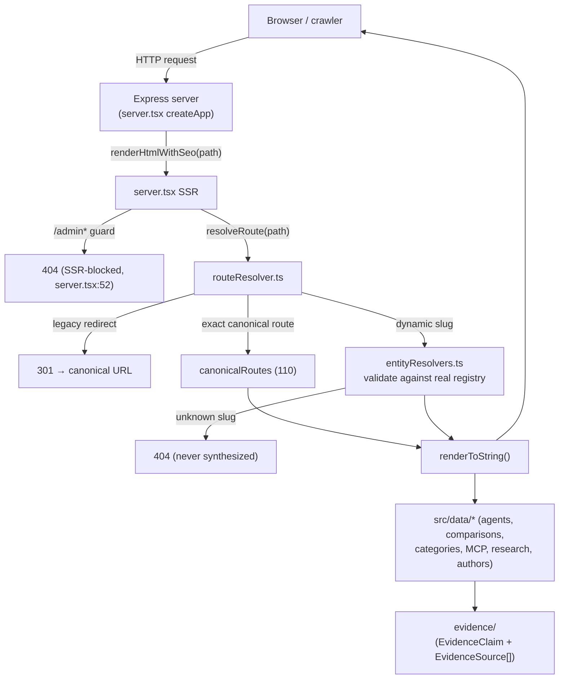

<div align="center">

# Best AI Agent

**India-first, evidence-backed directory for discovering, comparing, and pricing AI agents.**

[](https://github.com/CodesbyFebin/best-ai-agent/actions/workflows/ci.yml)
[](#tech-stack)
[](#tech-stack)
[](#tech-stack)
[](#tech-stack)

[Documentation](docs/INDEX.md) · [Quick Start](#quick-start) · [Contributing](CONTRIBUTING.md) · [Architecture](docs/ARCHITECTURE.md) · [Security](SECURITY.md)

</div>

> **What this is:** an India-first, evidence-backed platform that catalogues, compares, and prices AI agents. Every entity carries source-linked identity, a verification status, and an `EvidenceClaim` whose sources cite the exact supporting passage, retrieved-at date, and authority level (`primary`/`secondary`/`tertiary`) — gated by confidence thresholds set in `EVIDENCE_RULES`. It is **not** an agent framework or runtime — it does not execute LLM loops, host models, or orchestrate tools. It evaluates agents that other people built.

---

## Why Best AI Agent?

AI-agent marketing is noisy and India-specific context is missing from international directories. This project provides an **independent, evidence-first** evaluation layer:

- **Every claim traces to a verified receipt** with an exact supporting passage, retrieved-at date, and authority label — not a vendor slogan.
- **India-first:** INR pricing, GST signals, DPDP considerations, and an India-Fit score are first-class, not an afterthought.
- **Canonical, not chaotic:** one canonical URL per entity, 171 legacy redirects consolidated, dynamic slugs validated against real registries (unknown slugs 404, they aren't synthesized).

---

## Features

| Area | What it does |
|------|--------------|
| Agent profiles | Source-linked identity + verification status for ~70 coding, research, voice, business, and automation agents |
| Comparisons | Head-to-head A-vs-B pages with a single canonical direction (reverse pairings redirect) |
| Category hubs | Topical silos connecting related entities without duplicating canonical pages |
| MCP servers | Setup guides connecting clients (Claude, Cursor) to Model Context Protocol servers |
| India pricing | INR pricing tables with tax/billing/payment context where the vendor publishes it |
| Evidence engine | `EvidenceClaim` receipts (statement + `EvidenceSource[]` with url/passage/`retrievedAt`/`authority` + confidence + status) gating factual claims |
| Discovery | Segmented XML sitemaps, JSON-LD, RSS, and an `llms.txt` index for AI crawlers |
| Knowledge graph API | `/api/graph/{related,similar,path}` between entities |

---

## Demo

**[bestaiagent.in](https://bestaiagent.in)** is the owner's production site — maintained in a separate repository, with its own evidence model (SHA-256 source snapshots; see `docs/ARCHITECTURE.md` §3). This repository ships its own Vercel deployment configuration (`vercel.json` + `api/index.ts`); see `DEPLOYMENT.md` for the local build.

> **Screenshots & GIFs:** genuine captures of the running application are planned and tracked in `docs/`. No fabricated UI, fake dashboards, or invented metrics are used.

---

## Quick Start

```bash
# 1. Install dependencies (npm is the canonical lockfile — CI runs `npm ci`)
npm ci

# 2. Configure environment
cp .env.example .env        # then edit .env with your own GEMINI_API_KEY / APP_URL

# 3. Run the development server (SSR + Vite HMR)
npm run dev
# → http://localhost:3000
```

<!-- QUICKSTART-VERIFY -->
> The default `PORT` is read from `process.env.PORT || 3000`. Verify the stack locally before pushing — see [Verification](#verification).
<!-- /QUICKSTART-VERIFY -->

---

## Installation

Requirements: **Node.js 24+** (matches CI), npm.

```bash
git clone https://github.com/CodesbyFebin/best-ai-agent.git
cd best-ai-agent
npm ci
cp .env.example .env        # GEMINI_API_KEY, APP_URL (placeholders are safe for local dev)
```

> `bun.lock` exists in the tree; **delete it** if you use npm (CI uses `npm ci` and `package-lock.json`). See `AUDIT.md` §G.4 (dual-lockfile gap).

---

## Explore & extend

**Find an agent (user):** browse `/agents/`, filter by `/categories/`, compare at `/compare/`, or read MCP setup at `/mcp/servers/`.

**Add a listing (contributor):** add an entity to `src/data/agents.ts`, attach an `EvidenceClaim` (statement + at least one `EvidenceSource` citing the exact supporting passage, retrieved-at date, and authority level — gated by `EVIDENCE_RULES`), and the resolver, sitemap, and verify scripts pick it up automatically. See `CONTRIBUTING.md`.

---

## Architecture

Request flow (simplified; full diagram in [`docs/ARCHITECTURE.md`](docs/ARCHITECTURE.md)):


```mermaid
flowchart TD
    Browser["Browser / crawler"] -->|HTTP request| Express["Express server\n(server.tsx createApp)"]
    Express -->|"renderHtmlWithSeo(path)"| Render["server.tsx SSR"]
    Render -->|"/admin* guard"| Admin404["404 (SSR-blocked, server.tsx:52)"]
    Render -->|"resolveRoute(path)"| Resolver["routeResolver.ts"]
    Resolver -->|legacy redirect| Redirect["301 → canonical URL"]
    Resolver -->|exact canonical route| Canonical["canonicalRoutes (110)"]
    Resolver -->|dynamic slug| Entity["entityResolvers.ts\nvalidate against real registry"]
    Entity -->|unknown slug| NotFound404["404 (never synthesized)"]
    Canonical --> SSR["renderToString(<AppRouter route=.../>)"]
    Entity --> SSR
    SSR --> DataLayer["src/data/* (agents, comparisons,\ncategories, MCP, research, authors)"]
    DataLayer --> Evidence["evidence/\n(EvidenceClaim + EvidenceSource[])"]
    SSR --> Browser
```

Read the full, code-sourced diagram and component lifecycle in [`docs/ARCHITECTURE.md`](docs/ARCHITECTURE.md).

---

## Evidence & data sources

Unlike a framework with "tools" and "memory", this product's integrations are **sources**:

- **Vendor/docs sites** are quoted into an `EvidenceSource.passage` with `retrievedAt` + `authority` (e.g. `https://cursor.com/docs/models-and-pricing` cited as the source backing the Cursor pricing claim).
- **Upstream open-source repositories** are linked as an entity's `sourceUrl` (e.g. `https://github.com/cline/cline`).
- **Evidence authority** is labeled `primary`, `secondary`, or `tertiary` — only `primary` (or explicitly-flagged) claims are presented as fact.

No claim is asserted without an evidence receipt. Unsupported claims are quarantined (`quarantine/`, `check:quarantine.ts`).

---

## Configuration

| Variable | Required | Purpose |
|----------|----------|---------|
| `GEMINI_API_KEY` | Optional (for AI features) | Google Gemini API key |
| `APP_URL` | Optional | Canonical site URL (self-referential links, OAuth, API) |
| `PORT` | Optional (default `3000`) | Server port |
| `NODE_ENV` | Standard | `production` switches to the `dist/server.cjs` bundle |
| `VERCEL` | Set by Vercel | Switches `api/index.ts` handler path |

Never commit real secrets. `.gitignore` already excludes `.env`.

---

## Production Deployment

```bash
npm run build      # vite build && esbuild --bundle server.tsx → dist/server.cjs
npm start          # node dist/server.cjs
```

Deploy target: **Vercel** (`vercel.json` routes `/assets`, `.txt` files, and the catch-all to the server handler). Production `bestaiagent.in` runs on a separate Next.js deployment; this repo ships its own preview build.

Full deployment notes: [`DEPLOYMENT.md`](DEPLOYMENT.md).

---

## Verification

A release-gate runs **16 verification scripts** covering the load-bearing contracts:

```
npm run lint                 # tsc --noEmit (typecheck)
npm run check:quarantine     # quarantine integrity
npm run build                # production bundle
npm run test:evidence        # evidence receipts valid + hash-shaped
npm run test:sitemap         # sitemap index + segments
npm run test:ssr             # SSR hydration
npm run test:graph           # knowledge-graph integrity
npm run test:manifest        # content manifests
npm run test:production      # full production-readiness suite
npm run test:scope-freeze    # scope-freeze invariants
```

CI (`.github/workflows/ci.yml`) runs all of the above on every PR and push to `main`.

---

## Documentation

| Doc | What's in it |
|-----|--------------|
| [`docs/INDEX.md`](docs/INDEX.md) | Documentation index — start here |
| [`docs/ARCHITECTURE.md`](docs/ARCHITECTURE.md) | Code-sourced architecture & request-flow diagrams |
| [`docs/POSITIONING.md`](docs/POSITIONING.md) | Product positioning (WHAT/WHO/WHY/HOW) |
| [`DEVELOPMENT.md`](DEVELOPMENT.md) | Local setup, architecture, coding standards |
| [`DEPLOYMENT.md`](DEPLOYMENT.md) | Production deployment |
| [`TESTING.md`](TESTING.md) | How to run and interpret the verify suite |
| [`CI_INVARIANTS.md`](CI_INVARIANTS.md) | The contracts CI enforces |
| [`AUDIT.md`](AUDIT.md) | Phase 0 evidence-first audit |

---

## Roadmap

VERIFIED, evidence-grounded items only (no fabricated timelines):

- [ ] Capture genuine screenshots/GIFs of the running app for this README
- [ ] Consolidate 22 root process docs into `docs/archive/` (see `AUDIT.md` §H.2)
- [ ] Add real ESLint config + split `lint`/`typecheck` (see `AUDIT.md` §G.2)
- [ ] Confirm licensing decision with owner, then add `LICENSE`
- [ ] AEO `Question`/`acceptedAnswer` enrichment on key entity pages (in flight on production)

A more complete plan lives in [`docs/MASTER_ROADMAP.md`](docs/MASTER_ROADMAP.md).

---

## Community

- **Discussions:** for ideas, Q&A, and showing what you built (enable in repo settings).
- **Issues:** bug reports, content corrections, and evidence/source disputes — use the issue templates in `.github/ISSUE_TEMPLATE/`.
- **Contributing:** see [`CONTRIBUTING.md`](CONTRIBUTING.md) — good first issues are labeled `good first issue`.
- **Code of conduct:** [`CODE_OF_CONDUCT.md`](CODE_OF_CONDUCT.md) applies to all participation.

---

## Contributing

We welcome contributions that add **verified** entities, fix broken links/redirects, or improve evidence quality. Before opening a PR:

1. `npm ci && npm run lint && npm run build`
2. Run the relevant `npm run verify-*` / `npm run test:*` scripts
3. Attach a real source URL and an `EvidenceClaim` for any new factual claim
4. Open a PR using the template in `.github/PULL_REQUEST_TEMPLATE.md`

See [`CONTRIBUTING.md`](CONTRIBUTING.md) for the full workflow.

---

## Security

This is a content platform with API endpoints (`/api/*`) and an admin token gate. Report vulnerabilities **privately** — see [`SECURITY.md`](SECURITY.md). Do not open a public issue for security reports. `public/security.txt` and `public/humans.txt` are served at the site root.

---

## License

**Licensing decision: pending owner confirmation.** The README previously stated "Proprietary — All rights reserved." Per the project's evidence-first rule, the license will be formalized in a `LICENSE` file **only after the owner confirms the decision**; it will not be silently changed. (See `AUDIT.md` §O.2.)

---

## Star History / Project Activity

Genuine activity only — no fabricated stars or "trending" claims. Real signals: CI runs on every PR; commit history shows active GSC-recovery and routing work (see `git log` and `PROJECT_TRACKER.md`).

<!-- A Star History chart will be added once the repository has genuine public star data. -->

<div align="center">

**Evidence wins. One receipt per claim.**

</div>
