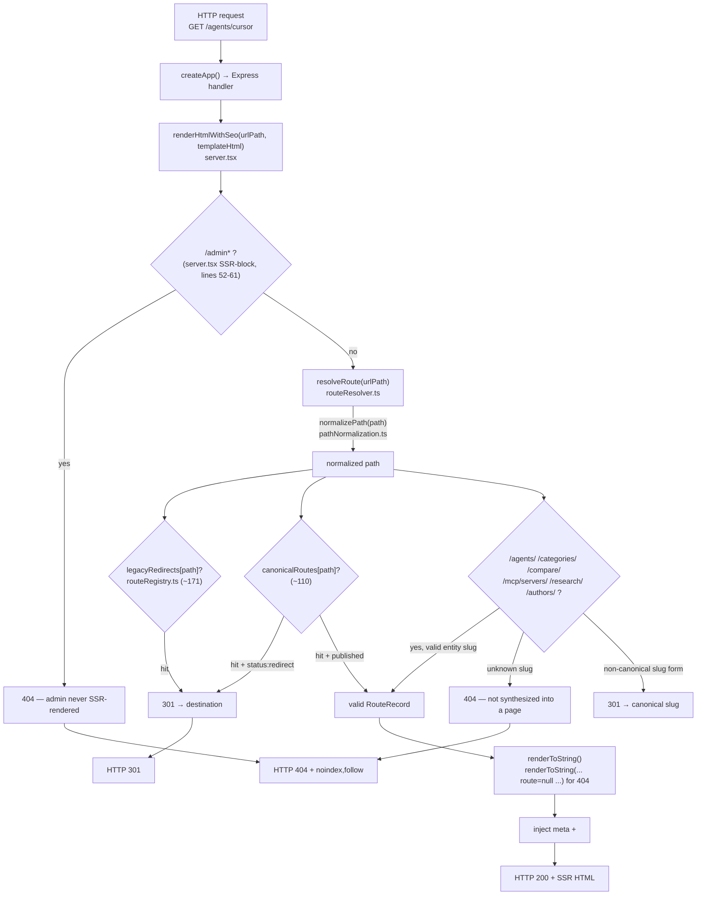
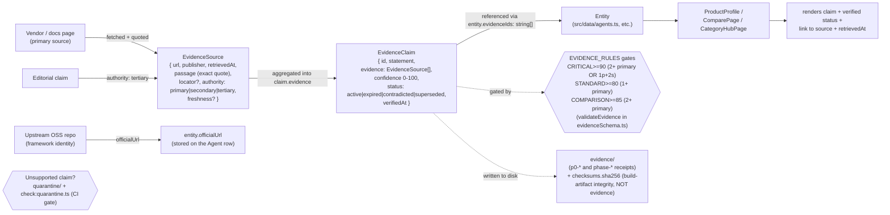
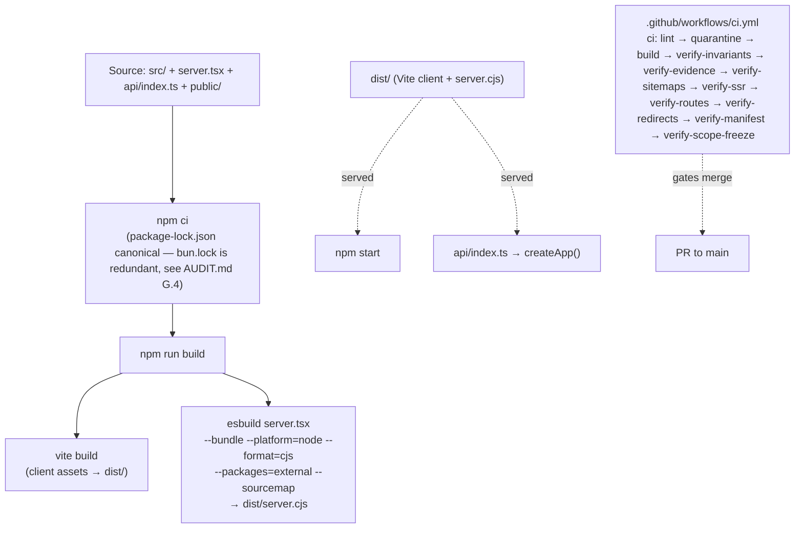
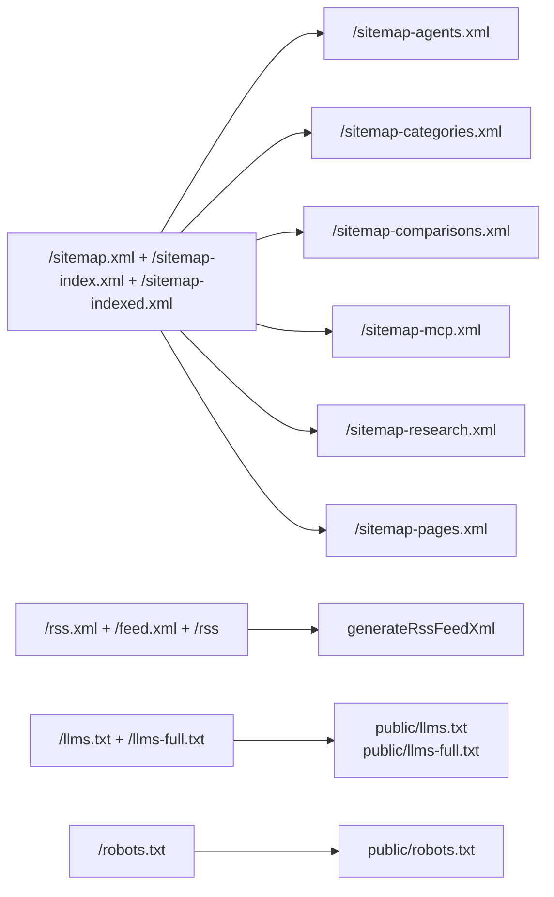

# BestAIAgent.in — Platform Architecture

> **Evidence-first rewrite (2026-08-20).** This document was rewritten to remove fabricated metrics (the prior version claimed "53 canonical routes", "100/100", "417/417", "Production Ready", and referenced `renderSsrBody.ts` / `head-manager.tsx` files that do not exist in the tree). Every figure below is traced to a verified source on commit `a54d4fa`. Counts are dated; if the code drifts, this doc must be regenerated from `scripts/audit-baseline.ts` + `src/routing/routeRegistry.ts`.
> **Product type:** this is a content/evaluation catalogue, not an agent runtime — see [`POSITIONING.md`](./POSITIONING.md). The diagrams describe request, resolution, evidence, and rendering lifecycles that actually exist here (adapted from the master prompt's "agent / tool / memory / model" flow language to the real product type).

---

## 1. System overview

```mermaid
flowchart TB
    subgraph Runtime["Runtime (process)"]
        Express["Express app\n(server.tsx → createApp, line 160)"]
        Resolver["routeResolver.ts\nresolveRoute(path)"]
        Registry["routeRegistry.ts\n110 canonical routes / 171 redirects\n(as of 2026-08-20)"]
        Entities["entityResolvers.ts\nvalidate slugs against real registry"]
        Data["src/data/*\nagents • categories • comparisons\nresearch • directory • evidence"]
        Sitemap["sitemapGenerator.ts\ngenerateMasterSitemapXml + generateSegmentedSitemapXml"]
        Rss["utils/rss-feed-generator.ts\ngenerateRssFeedXml"]
        Graph["/api/graph/*\nrelated • similar • path"]
    end
    subgraph Deploy["Deploy targets"]
        Vercel["api/index.ts\n→ require dist/server.cjs → createApp()"]
        Local["npm run dev\ntsx server.tsx + Vite HMR"]
        Prod["npm start\nnode dist/server.cjs"]
    end
    subgraph StaticOut["Static outputs (public/)"]
        Robots["robots.txt (27 lines)"]
        Llms["llms.txt (37 lines) + llms-full.txt (21 lines)"]
        Security["security.txt + humans.txt"]
    end
    Local --> Express
    Prod --> Express
    Vercel --> Express
    Express --> Resolver
    Resolver --> Registry
    Resolver --> Entities
    Entities --> Data
    Express --> Sitemap
    Express --> Rss
    Express --> Graph
    Express -.served at root via vercel.json.-> Robots
    Express -.served at root.-> Llms
    Express -.served at root.-> Security
```

**VERIFIED:** `createApp()` is an `async export` in `server.tsx` (line 160). `api/index.ts` does `require('../dist/server.cjs').createApp()` and caches an `appPromise`. Route counts are from `routeRegistry.ts` on commit `a54d4fa`. `sitemapGenerator.ts` exports the two XML generators. The five root text files live in `public/` and are routed by `vercel.json`'s `/(robots|llms|llms-full|security|humans)\.txt` rule.

---

## 2. Request lifecycle (the "agent lifecycle" analog adapted to a catalogue)



**VERIFIED:**
- `/admin*` is SSR-blocked before routing (`server.tsx` lines 52–61): returns a 404 title, never calls `resolveRoute`. Admin dashboard is never streamed to unauthenticated clients.
- 404 pages include `<meta name="robots" content="noindex, follow">` and omit a canonical tag (per the inline comment, "prevents indexing of invalid URLs").
- Resolution order (`routeResolver.ts`): home → legacy 301 → exact canonical (published or redirect) → dynamic entity (validated against the real registry; non-canonical slug → 301 to canonical; unknown slug → 404).
- `AppRouter` accepts a `route` prop and falls back to internal re-resolution for browser hydration (hybrid SSR + client resolution).

> **Note on the prior doc:** the previous version of this file claimed the SSR renderer lived in `src/routing/renderSsrBody.ts` and mentioned `src/routing/head-manager.tsx`. Neither file exists in `src/routing/` (verified: only `canonicalUrl.ts`, `entityResolvers.ts`, `evidenceRoutes.ts`, `pathNormalization.ts`, `routeRegistry.ts`, `routeResolver.ts`, `types.ts`). SSR is performed inline in `server.tsx` via `renderHtmlWithSeo` + `react-dom/server`'s `renderToString`. Do not re-add references to the non-existent files.

---

## 3. Evidence lifecycle (the "memory" analog — claims trace to receipts)



**VERIFIED (against `src/data/evidenceSchema.ts` + `agentEvidence.ts` + `verify-evidence.ts` on `a54d4fa`):**
- The evidence model in this donor repo is **`EvidenceClaim` + `EvidenceSource`**, not `EvidenceRecord` with a `contentHash`. A claim has `id`, `statement`, `evidence: EvidenceSource[]`, `confidence` (0-100), `status` (`active`/`expired`/`contradicted`/`superseded`), `verifiedAt`. A source has `url`, `publisher`, `retrievedAt`, `passage` (the EXACT supporting quote), `locator?`, `authority` (`primary`/`secondary`/`tertiary`), `freshness?`. (**Correction:** an earlier draft of this doc conflated the companion production repo's `EvidenceRecord{contentHash}` model with this one; the production repo hashes source content, this donor repo does not.)
- Confidence gates (`EVIDENCE_RULES`): `CRITICAL` ≥ 90 (2+ primary OR 1 primary + 2 secondary), `STANDARD` ≥ 80 (1+ primary), `COMPARISON` ≥ 85 (2+ primary). Asserted in `verify-evidence.ts` (`rules.CRITICAL.minConfidence !== 90` etc.).
- Per-entity claims are referenced via `evidenceIds?: string[]` on the `Agent` interface in `src/data/agents.ts`; `agentEvidence.ts` holds agent-specific evidence extensions (`PricingEvidence`, `CapabilityEvidence`); the on-disk `evidence/` tree carries build-time receipts (`p0-*`, `phase-*`) plus a `checksums.sha256` file that protects **build artifacts**, not evidence content.
- Content lifecycle is an 11-state machine (candidate → intent_validated → evidence_complete → blueprint_approved → draft → automated_validation → human_review → publish_approved → published → monitored → refresh_required); `verify-evidence.ts` asserts the default state is `candidate`.
- Unsupported claims are quarantined under `quarantine/` (includes `21k-manifest-data.json` + `README.md`) and gated by `npm run check:quarantine`, which CI runs before `npm run build`.
- `authority` labeling (`primary` / `secondary` / `tertiary`) correlates with the master prompt's VERIFIED / INFERRED / PLANNED classification — only `primary`-sourced claims are presented as fact.

---

## 4. Build & deploy lifecycle (the "model flow" analog — outputs that ship)



**VERIFIED:** build script from `package.json`: `vite build && esbuild server.tsx --bundle --platform=node --format=cjs --packages=external --sourcemap --outfile=dist/server.cjs`. Vercel function (`api/index.ts`) requires `../dist/server.cjs`; `vercel.json` routes `/assets`, `.txt` files, and the catch-all `/.*` to `/api/index`. CI sequence confirmed in `.github/workflows/ci.yml`.

---

## 5. Discovery & SEO outputs (served routes)



**VERIFIED:** all six segment endpoints are wired in `server.tsx` and served by Vercel's text-file route. The sitemap index references the six segments.

---

## 6. Error flow

| Trigger | Result | Notes |
|---------|--------|-------|
| `/admin*` SSR request | 404 | SSR-blocked before routing (`server.tsx` lines 52–61). |
| Unknown dynamic slug (`/agents/does-not-exist`) | 404 + `noindex, follow` | Validated against the real registry; never synthesized. |
| Unknown canonical path | 404 + `noindex, follow` | Same 404 path; no canonical tag. |
| Non-canonical slug form (`/agents/cursor-ai`) | 301 → `/agents/cursor` | Server redirects to the canonical slug. |
| Legacy URL in `legacyRedirects` | 301 → destination | Consolidation layer (~171 entries). |
| Quarantine drift | CI fails (`npm run check:quarantine`) | Prevents unsupported claims from shipping. |

---

## 7. API surface (verified)

| Route | Method | Purpose |
|-------|--------|---------|
| `/api/analyze-doc` | POST | Document analysis |
| `/api/recommend` | POST | Agent recommendations |
| `/api/submit-lead` | POST | Lead capture |
| `/api/submit-tool` | POST | Tool submission |
| `/api/subscribe` | POST | Newsletter subscription |
| `/api/graph/stats` | GET | Knowledge-graph statistics |
| `/api/graph/related/:type/:id` | GET | Related entities |
| `/api/graph/similar/:type/:id` | GET | Similar entities |
| `/api/graph/path/:ft/:fi/:tt/:ti` | GET | Entity path |
| `/api/admin/verify` | GET | Bearer-token check (admin) |
| `/api/admin/info` | GET | Admin info (auth required) |
| `/health` | GET | Health check |
| `/sitemap*.xml`, `/rss*.xml`, `/feed.xml`, `/llms*.txt`, `/robots.txt`, `/security.txt`, `/humans.txt` | GET | Discovery + SEO outputs |

> Security note: the `/api/admin/*` endpoints use a bearer-token compare, not a hardened identity system. See `SECURITY.md` once created (`AUDIT.md` §F.5) and `scripts/verify-admin-security.ts`.

---

## 8. What is **not** here (and why)

The master prompt's "agent lifecycle / tool execution / memory / model flow" sections describe an agent *runtime*. This repo is a **catalogue/evaluation platform** — it does not run LLM loops, call tools, hold agent memory, or serve model inference. The analogs above (request lifecycle, evidence lifecycle, build lifecycle) map those concepts onto what actually exists, so the diagrams remain truthful. Any "tool" / "memory" / "model" documentation belongs on the agent *entities' profile pages*, not in this repo's architecture.

---

## 9. Verification (dated; no fabricated aggregate scores)

As of commit `a54d4fa` (2026-08-20) on the **committed tree** (untracked scratch scripts set aside):

- `npm run lint` (`tsc --noEmit`) → exit 0 (commit `a54d4fa`)
- `npm run build` → produces `dist/server.cjs` + Vite client assets
- 16 `verify-*` scripts available; CI runs 9 of them in `ci.yml`

> The prior version of this file listed per-subsystem scores of "100" and a "Platform Score: 100/100" with "417/417" / "419/419" tests. Those figures were asserted without a reproducible harness and are **not** restated. For an evidence-first claims audit, see [`../AUDIT.md`](../AUDIT.md); for the current test reality run, `npm run lint && npm run build && npm run test:*`.
