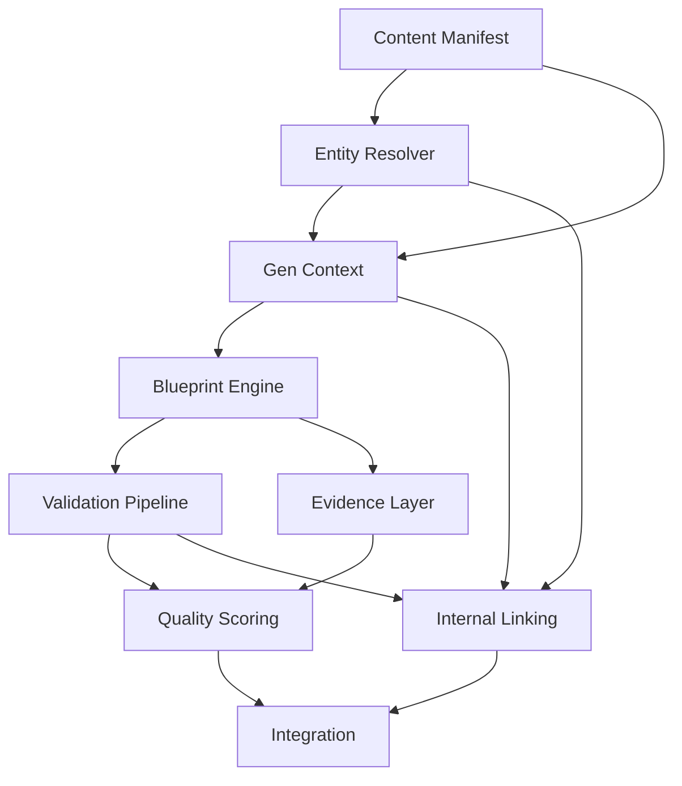

# Phase C — Implementation Plan

**Status:** Draft — Awaiting Scope Freeze Approval  
**Date:** 2026-07-26  
**Owner:** Platform Engineering & Content Platform  
**Phases:** C1–C9 (see WORK_BREAKDOWN.md for detailed tasks)

---

## Overview

Phase C implements the **Content OS** — the deterministic pipeline that transforms canonical entities into validated, reproducible content.

### Timeline (Estimated)

| Work Package | Duration | Start | End |
|--------------|----------|-------|-----|
| C1 — Content Manifest | 2 days | Day 1 | Day 2 |
| C2 — Entity Resolver | 2 days | Day 2 | Day 4 |
| C3 — Generation Context | 3 days | Day 4 | Day 7 |
| C4 — Blueprint Engine | 5 days | Day 7 | Day 12 |
| C5 — Validation Pipeline | 5 days | Day 12 | Day 17 |
| C6 — Evidence Layer | 3 days | Day 17 | Day 20 |
| C7 — Quality Scoring | 2 days | Day 20 | Day 22 |
| C8 — Internal Linking | 3 days | Day 22 | Day 25 |
| C9 — Integration | 4 days | Day 25 | Day 29 |

**Total:** ~29 working days (6 weeks with buffer)

---

## Milestones

- **M1 (C1 complete):** Manifest repository operational; verification tests pass
- **M2 (C4 complete):** First blueprint (ProductDetailV1) renders HTML
- **M3 (C5 complete):** Validation pipeline passes on generated content
- **M4 (C8 complete):** Internal links auto-injected and validated
- **M5 (C9 complete):** End-to-end pipeline; CI green; documentation complete

---

## Dependencies Graph

---

## Parallelization Strategy

- **C1** is independent — start immediately after freeze
- **C2** and **C3** can be developed in tandem (C3 depends on C2 API)
- **C4** needs C3 context; can start once C3 basic factory exists
- **C5** (rule engine) can be developed in parallel with **C4** (use mock BlueprintOutput)
- **C6** depends on C4 (evidence field in output) and C5 (rules) — start with C5
- **C7** depends on C5 validation report — start once first rules run
- **C8** depends on C2/C3 but independent from C4/C5/C6 — can run in parallel with them
- **C9** waits for all others

**Optimal path:** Start C1, then C2+C3 parallel, then C4+C5 parallel, then C6+C7+C8 parallel, finally C9.

---

## Risk Mitigation

| Risk | Probability | Impact | Mitigation |
|------|-------------|--------|------------|
| C4 (blueprints) takes longer than estimated | Medium | High | Start with simplest blueprint (product-detail) only; category can be deferred |
| Validation rule complexity (HTML parsing) | Medium | Medium | Use existing libraries (parse5); start with 5 core rules instead of 10 |
| Evidence extraction format issues | Low | Medium | Define schema early; test with sample HTML |
| Linking relevance quality low | Medium | Low | Start with simple rules (BELONGS_TO only); iterate on relevance Scoring |
| Quality threshold too strict/lenient | Medium | Medium | Make threshold configurable per manifest; adjust after first batch |
| Graph snapshot size grows too large | Medium | Medium | Enforce depth cap (default 2); provide way to request deeper only when needed |
| Test coverage targets not met | Low | Low | Prioritize critical paths first; aim for 80% initially, 90% later |

---

## Communication

- **Daily stand-up:** Blockers and progress updates
- **Weekly demo:** Show working increment (e.g., C1 complete, C4 renders page)
- **Mid-phase review:** At M2 (C4 complete) assess if schedule/scope needs adjustment
- **Phase completion:** All packages done → sign-off for Phase D

---

## Success Metrics

Technical metrics tracked throughout:

| Metric | Target | Measurement |
|--------|--------|-------------|
| Test pass rate | 100% | `npm test` |
| Test coverage | ≥85% average | `npm run test:coverage` |
| Build time (production) | <30s | `time npm run build` |
| Bundle size (server) | <5MB | `ls -lh dist/server.cjs` |
| End-to-end generation time (10 pages) | <10s | `npm run generate -- --all` |
| Validation rule latency (per page) | <100ms | benchmarks |
| Quality score (first pages) | ≥75 | `npm run quality:score` |

---

## Exit Criteria (Phase C)

All **yes** to ship:

- [ ] C1–C9 work packages complete (exit criteria met)
- [ ] All contracts frozen at v1.0.0 (no `-draft`)
- [ ] All ADRs 0002–0009 approved
- [ ] CI passes 100% on main branch
- [ ] Documentation complete (architecture index, spec, ADRs, integration guide)
- [ ] No open blockers from Scope Freeze
- [ ] Baseline metrics recorded before changes (BASELINE_METRICS.md)
- [ ] Team sign-off (Platform, Content, Quality leads)

**Next:** Phase D — Editorial OS (content editing workflows)

---

## References

- [Scope Freeze Document](../SCOPE.md)
- [Work Breakdown](WORK_BREAKDOWN.md)
- [Baseline Metrics](BASELINE_METRICS.md)
- [Contract Index](CONTRACT_INDEX.md)
- [ARCHITECTURE Index](../ARCHITECTURE/README.md)

---

*This plan will be executed only after Scope Freeze sign-off. Do not start implementation before approval.*
